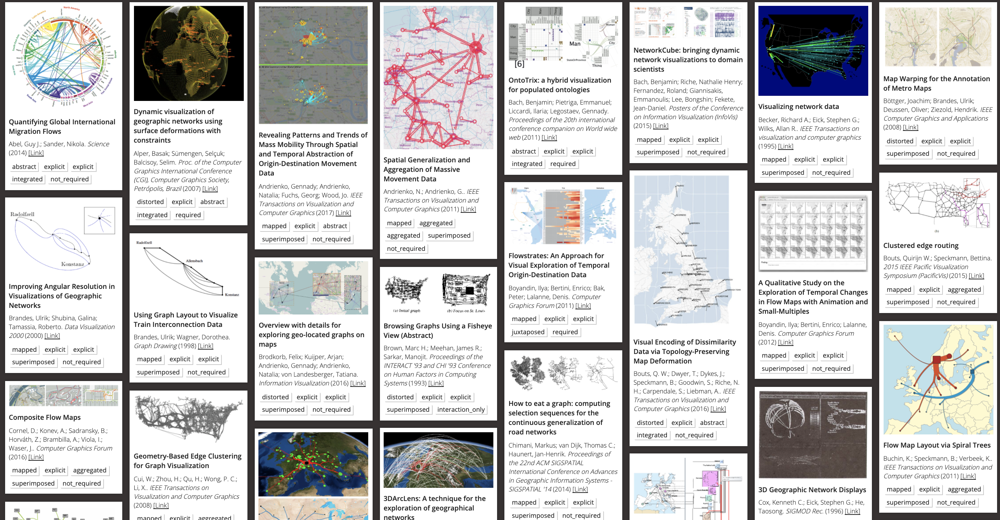

The **VisHub** is an interdisciplinary research lab seeking creative ways to interactive, exploratory and explanatory data visualizations across domains and environments (e.g., screen, physical, immersion). Our goal is to make data visualiztion and data analytics understandable by everyone. We are based at the [Institute for Design Informatics](https://www.designinformatics.org/) and the [School of Informatics](https://www.ed.ac.uk/informatics) at the [University of Edinburgh](https://www.ed.ac.uk). Our research includes, but is not limited to:

-   data-driven storytelling,
-   visualization education
-   immersive Analytics,
-   network and spatio-temporal visualization,
-   physical visualization,
-   data visualization and NLP

We are heavily involved in co-organizing [Edinburgh's Data Vis Meetup](https://www.meetup.com/meetup-group-vBHbCmgh). [Get in touch with us](mailto:bbach@ed.ac.uk) if you want to become involved.

# News

-   _March 2020:_ >> **WE'RE HIRING** for 3(!) postdoc and engineer positions on [networks, storytelling and vis literacy](jobs-viscovery.html) as well as [vis in health](jobs-health.html).
-   _Dec 2020:_ **Four full [papers](publications.html)** accepted at ACM CHI 2021!!
-   _Oct 2020:_ [PhD Scholarship](phd-graphics-medicine.html) in Visualising Complex Care Pathways in Later Life.
-   _Oct 2020:_ Three full [papers](publications.html) accepted at [IEEE VIS 2020](http://ieeevis.org)!
-   _Oct 2020:_ Co-organizing [IEEE VIS Workshop on Guidelines in Visualiztion: VisGuides](https://nms.kcl.ac.uk/c4pgv).
-   _Oct 2020:_ Co-organizing [IEEE VIS Workshop on Visualization Education: VisActitivies](http://visactivities.github.io).
-   [..more](news.html)

[More news...](news.html)

<!-- to make the nav link work -->
<h1 id="projects">Topics & Projects (<a href="/publications">> Publications</a>)</h1>

## Visualization Education

Designing visualization activities and teaching resouces for education with visualization. [vistools.net](http://vistools.net)

## Text Analysis for Clinical Guidelines

In this project we are applying a combination of natural language processing and data visualisation to UK hospital guidelines for treating COVID-19 patients.
[Web](https://www.ltg.ed.ac.uk/projects/covid19-guideline-browser/)

## Online Course Data Visualization for Professionals

Running from June 15 to July 17. [datavis-online.github.io](https://datavis-online.github.io/)

## Data Visualization Cheat Sheets

Data Visualization Cheat Sheets are aimed at supporting learning and teaching of data visualization techinques and investigate ways to better teach data visualization in general. [visualizationcheatsheets.github.io](http://visualizationcheatsheets.github.io)

## Data Comics

Data Comics combine visual language and narrative patterns from traditional comics to tell expressive stories with data and visaulization. We explore this exciting medium and develop workshops and guiding material. [datacomics.net](http://datacomics.net)

## Immersive Analytics

The **[Edinburgh VisHub](http://edinburghvishub.github.io)** is an university-wide lab for data visualization equipment to foster research, collaboration, learning, and outreach. **[DXR](https://sites.google.com/view/dxr-vis)** and **[IATK](https://github.com/MaximeCordeil/IATK)** are two toolkits for creating immersive data visualizations in augmented and virtual reality. Check how to participate in our [upcoming workshop at CHI 2020](http://immersiveanalytics.io).

## The Vistorian: Network Visualization

The Vistorian is an Interactive Visualizations for Dynamic and Multivariate Networks. Free, online, and open source. More information on the Vistorian-blog. [vistorian.net](http://vistorian.net)

## Survey on Geospatial Networks

[geonetworks.github.io](https://geonetworks.github.io)
