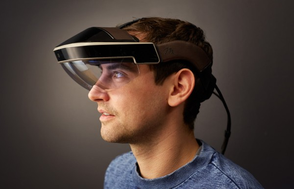
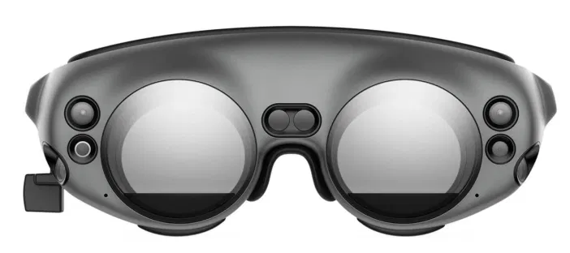
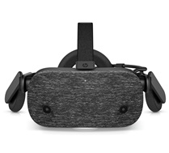
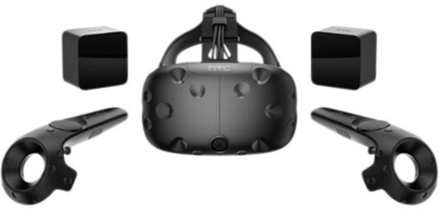
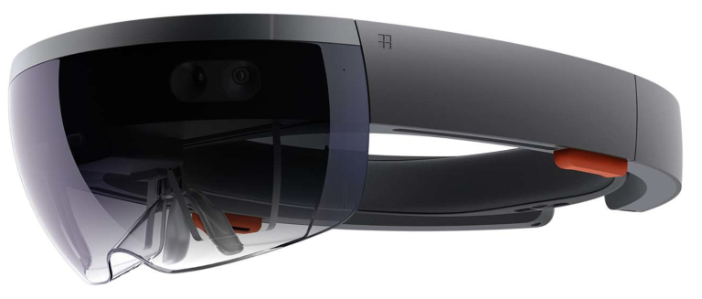

# Immersive and Virtual Reality

Immersive visualization involves the use of immersive technolgy such as virtual reality (VR), augmented reality (AR) or mixed reality (MR) 

* __AR__—Augmented Reality: Blending virtual content into the real world
* __VR__—Virtual Reality: Complete immersion in virtual world, stereoscopic.
* __MR__—Mixed Reality: Augmented reality offering stereoscopy and environment tracking
* __XR__—Extended reality: umbrella term for virtual-reality combined environments and human-machine interactions

## Equipment

### Mixed Reality Meta Headset

The Meta Head-mounted display provides for stereoscopic vision, while being tethered to the computer. Calculations are performed on strong GPU hardware. Stronger graphics cards give you more performance. The field of view reasonable large (much larger than HoloLens). Good resolutions. Slow movements without lag. Interaction through simple hand-tracking. Integration possible with Leap. Special portable computer available for full mobile.

No beacons for tracking required. Environmental tracking OK but not great

__Update:__ Unfortunately, as of early 2019, Meta has stopped working as a company however, the device is still present and working well.

### Magic Leap 

Magic Leap is is similar to HoloLens, but more performant with a larger field of view. Environment tracking is good. Its ~$2200 in the developer edition.

[https://www.magicleap.com]

### HP Reverb

High-resolution VR head-set with controllers. Requires tethering to machine with powerful graphics card.

[Link](https://store.hp.com/UKStore/Merch/Offer.aspx?p=b-hp-reverb-vr-headset)

### Zed Mini 2

Stereo cameras for VR head-sets, including depth sensing, dynamic space mapping.

[https://www.stereolabs.com/zed-2](https://www.stereolabs.com/zed-2)

### HTC Vive

Stationary head-mounted display. Tethered to high-end graphics card. Requires two beacons for tracking (very stable). Provides ~2x2meters of actionable space. Controllers for each hand for easy interaction with virtual content. Hand tracking possible through, e.g., leap motion.

Price: $600-1,500 + High-end Graphics Card (~$1,000) + PC (Nov 2018).

### Hololens

Head-mounted display for stereoscopic vision. Entirely mobile with environment tracking. Calculations performed on mounted microprocessor. Tethering with computer possible, but performance much slower than with high-end graphics cards and MetaVision. Field of view fairly small. Resolution OK. Development on all platforms (Mac, Linux, Win, ..). Deployment through Windows machines only.

Price: $3,000 headset only (Nov 2017)

## Development Resources

### General Development Resources
* __[Unity](https://unity.com)__ Game engine and development platform. Allows export/deployment towards most XR environments.
* __[Vuforia](https://developer.vuforia.com/)__ Marker tracking for AR/MR. Available as package for Unity.
Visualization Specific Development Resources
* __[IATK](https://research.monash.edu/en/publications/iatk-an-immersive-analytics-toolkit)__ Immersive Analytics Toolkit is a Unity project to help you build high quality, interactive and scalable data visualisationsin Immersive Environments (Virtual/Augmented Reality).
* __[DXR](https://sites.google.com/view/dxr-vis)__ is a toolkit for rapidly prototyping Data visualizations in XR (augmented, mixed, and virtual reality). A visualization in DXR is a collection of Unity game objects whose properties such as position, color, and size are mapped to data attributes. This mapping can be specified interactively at runtime via a graphical user interface (GUI) or via a high-level programming interface, inspired by Polestar and Vega-Lite, respectively. DXR is extensible, allowing the use of most Unity game objects for custom marks and channels.
* __[VR-VIZ](https://github.com/mustafasaifee42/VR-Viz)__ A-Frame based React component for data visualization in VR and AR. VR-Viz provide a high-level react components to generate 3D visualization in webVR. It combines A-Frame with React (for DOM manipulation) and D3 (for data visualizations) to generate visualization in VR. It provides a JSON syntax for generating visualizations (the concept is inspired from Vega-Lite)

