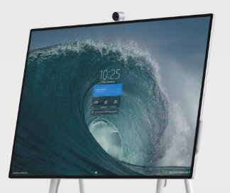
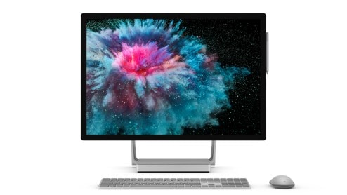
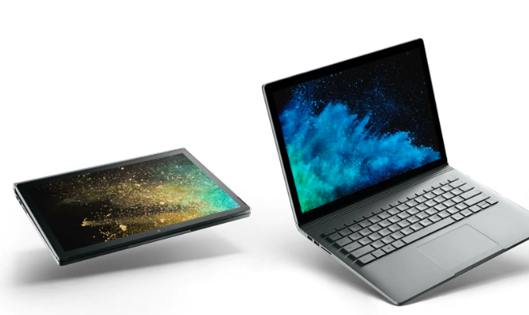

# Pen, Touch, Screens, and Projection

### Microsoft Surface Hub

84'' pen + touch display on movable stand, running either on battery or plug electiciy. 

* 84'' 3840 x 2560 pixels display
* Intel® UHD Graphics 620
* Microsoft Surface Hub 2 Pen (active)

[Link](https://www.microsoft.com/en-gb/surface/business/surface-hub-2)

### Microsoft Surface Studio 2

28'' pen and touch display. Movable from screen-mode (vertical screen) to studio-mode (almost horizontal). Great for skeching, large screen visualizaion, collaborative touch applications.

* 28'' PixelSense™ Display with 4500 x 3000 (192 PPI) resolution, 3:2 aspect ratio, and 10 point multi-touch.
* 1TB storage
* WiFi
* 4 x USB 3.0 (one high power port), full-size SD™ card reader (SDXC) compatible, USB-C, 3.5 mm headphone jack, 1 Gigabit Ethernet port
* NVIDIA® GeForce® GTX 1060 6GB GDDR5 memory (with i7/16/1TB configuration)

[Link](https://www.microsoft.com/en-gb/surface/devices/surface-studio-2/tech-specs)

### Microsoft Surface Book 2

13'' and 15'' laptop with detachable display and pen+touch surface. Ready for touch applications and AR.x

Specs: 
* 1060 NVIDIA GeForce GTX graphics
* 16 BG RAm
* Intel Core i7 8th Gen
* 512 GB storage 

[Link](https://www.microsoft.com/en-gb/p/surface-book-2/8mcpzjjcc98c?s_kwcid=AL!4249!3!379043953098!e!!g!!surface+book+2&ef_id=CjwKCAiAmNbwBRBOEiwAqcwwpX_aSaPtJteE-PKTtKnmlBCklzd82cFNjbE2-6kmx3b2y-sijhoH3BoCtDAQAvD_BwE%3aG%3as&invsrc=search&cl_vend=google&cl_ch=sem&cl_camp=976592773&cl_adg=48767308499&cl_crtv=379043953098&cl_kw=surface+book+2&cl_pub=google.com&cl_place=&cl_dvt=c&cl_pos=1t2&cl_mt=e&cl_gtid=kwd-300551366843&cl_pltr=&cl_dim0=CjwKCAiAmNbwBRBOEiwAqcwwpX_aSaPtJteE-PKTtKnmlBCklzd82cFNjbE2-6kmx3b2y-sijhoH3BoCtDAQAvD_BwE%3aG%3as&OCID=AID2000006_SEM_CjwKCAiAmNbwBRBOEiwAqcwwpX_aSaPtJteE-PKTtKnmlBCklzd82cFNjbE2-6kmx3b2y-sijhoH3BoCtDAQAvD_BwE%3aG%3as&activetab=pivot%3aoverviewtab) 
